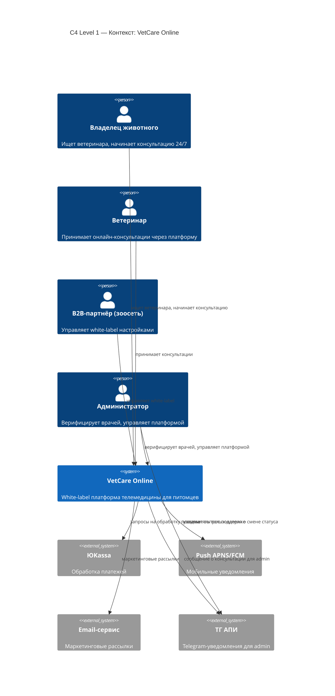

ПРАКТИЧЕСКОЕ ЗАДАНИЕ 1
# VetCare Online — Телемедицина для питомцев

**Бизнес-модель:** B2B2C

---

## Elevator Pitch

Многие владельцы домашних животных сталкиваются с проблемой: срочно нужна консультация ветеринара, но клиника закрыта, а ехать в круглосуточную — час в очереди.

Мы создали VetCare Online — white-label платформу телемедицины для питомцев. Крупные зоосети и ветклиники продают подписку под своим брендом, получая дополнительный доход и повышая лояльность клиентов. Владельцы получают 24/7 доступ к лицензированным ветеринарам за 5 минут, а зоосеть — рост частоты визитов в офлайн-точки за счет рекомендаций лекарств и кормов после консультаций.

---

## LEAN CANVAS

### 1. ПРОБЛЕМА
- Владельцы животных не могут быстро получить консультацию ветеринара в нерабочее время
- Зоосети теряют клиентов между покупками из-за отсутствия цифровых сервисов
- Ветклиники перегружены очными приемами, легкие консультации занимают время врачей

### 2. СЕГМЕНТЫ ПОТРЕБИТЕЛЕЙ
- B2B-партнеры: крупные зоосети («Четыре Лапы», «Бетховен», «Зоозавр»), сети ветклиник
- Конечные потребители: владельцы собак, кошек и других домашних животных, ценящие время и готовые платить за удобство

### 3. УНИКАЛЬНОЕ ЦЕННОСТНОЕ ПРЕДЛОЖЕНИЕ
- Для партнера: white-label платформа под их брендом без затрат на разработку, дополнительный доход от подписок, рост LTV клиента, повышение частоты визитов в офлайн
- Для пользователя: 24/7 доступ к лицензированному ветеринару в чате или видео за 5 минут, рекомендации с привязкой к товарам партнера

### 4. РЕШЕНИЕ
- White-label мобильное приложение с онлайн-чатом и видеозвонками ветеринарам 24/7
- AI-триаж для автоматической маршрутизации запросов
- Интеграция с товарным каталогом партнера для рекомендаций лекарств и кормов
- Напоминания о прививках и история консультаций

### 5. КАНАЛЫ
- B2B: прямые продажи в зоосети и ветклиники, профильные выставки, партнерства с дистрибьюторами кормов
- B2C: партнер продвигает сервис через свои точки продаж, кассы, SMS-рассылки, программу лояльности

### 6. ПОТОКИ ПРИБЫЛИ
- SaaS-подписка от зоосети (фиксированная плата + процент от выручки)
- Комиссия с подписок конечных пользователей (50/50 с партнером)
- CPA-комиссия от производителей кормов и препаратов за рекомендации

### 7. СТРУКТУРА ИЗДЕРЖЕК
- Разработка и поддержка white-label платформы
- Оплата ветеринаров (сдельная или почасовая)
- B2B-отдел продаж и клиентский успех
- Хостинг и инфраструктура
- Юридическое сопровождение (лицензии на телемедицину)

### 8. КЛЮЧЕВЫЕ МЕТРИКИ
- Количество B2B-партнеров
- Количество активных подписчиков (MAU)
- Средний чек подписки
- Конверсия из консультации в покупку товара
- Отток партнеров

### 9. СКРЫТОЕ ПРЕИМУЩЕСТВО
- White-label модель: зоосети получают собственный брендированный сервис и не отправляют клиентов к конкурентам
- Интеграция с товарным каталогом: монетизация не только на подписке, но и на продажах товаров
- Наличие лицензии на телемедицину: партнер не берет на себя юридические риски

ПРАКТИЧЕСКОЕ ЗАДАНИЕ 2
# 🐾 VetCare Online — Практическое задание №2

> **Тема:** Телемедицина для питомцев | **Модель:** B2B2C | **White-label платформа**

---

## 1. Роли (целевые аудитории)

| Роль | Описание |
|------|----------|
| 🧑‍💻 **Владелец животного** | Ищет быструю ветконсультацию 24/7, не хочет ехать в клинику ночью |
| 🏪 **B2B-партнёр (зоосеть)** | Хочет white-label сервис под своим брендом и дополнительный доход от подписок |
| 🩺 **Ветеринар** | Принимает онлайн-консультации через платформу, получает сдельную оплату |
| ⚙️ **Администратор платформы** | Управляет партнёрами, врачами, контентом и метриками |

---

## 2. User Stories

### 👤 Владелец животного

| # | История | Приоритет | Этап |
|---|---------|-----------|------|
| 1 | Как **владелец животного**, я хочу зарегистрироваться и добавить профиль питомца, чтобы консультации были персонализированы | `Must` | MVP |
| 2 | Как **владелец животного**, я хочу начать чат с ветеринаром за <5 минут, чтобы получить помощь в любое время суток | `Must` | MVP |
| 3 | Как **владелец животного**, я хочу провести видеозвонок с ветеринаром, чтобы врач увидел симптомы питомца | `Must` | MVP |
| 4 | Как **владелец животного**, я хочу оплатить подписку онлайн (неделя / месяц / год), чтобы иметь доступ к платформе | `Must` | MVP |
| 5 | Как **владелец животного**, я хочу видеть историю всех консультаций, чтобы не повторять диагностику | `Should` | MVP |
| 6 | Как **владелец животного**, я хочу получать рекомендации конкретных товаров (корма, препараты) прямо в чате | `Should` | MLP |
| 7 | Как **владелец животного**, я хочу получать пуш-напоминания о прививках и обработках питомца | `Should` | MLP |
| 8 | Как **владелец животного**, я хочу оценить консультацию и оставить отзыв, чтобы влиять на качество сервиса | `Could` | MLP |
| 9 | Как **владелец животного**, я хочу выбрать конкретного ветеринара из списка | `Could` | MLP |
| 10 | Как **владелец животного**, я хочу отменить или возобновить подписку в приложении самостоятельно | `Must` | MVP |

### 🏪 B2B-партнёр

| # | История | Приоритет | Этап |
|---|---------|-----------|------|
| 11 | Как **B2B-партнёр**, я хочу получить white-label версию приложения со своим логотипом и цветами | `Must` | MVP |
| 12 | Как **B2B-партнёр**, я хочу видеть дашборд с метриками (подписчики, выручка, конверсия) | `Should` | MVP |
| 13 | Как **B2B-партнёр**, я хочу интегрировать свой товарный каталог для рекомендаций ветеринаров | `Should` | MLP |

### 🩺 Ветеринар

| # | История | Приоритет | Этап |
|---|---------|-----------|------|
| 14 | Как **ветеринар**, я хочу видеть очередь входящих запросов и принимать их | `Must` | MVP |
| 15 | Как **ветеринар**, я хочу видеть профиль и историю питомца перед консультацией | `Should` | MLP |
| 16 | Как **ветеринар**, я хочу прикреплять назначения и рекомендации в формате PDF | `Could` | MLP |

### ⚙️ Администратор

| # | История | Приоритет | Этап |
|---|---------|-----------|------|
| 17 | Как **администратор**, я хочу верифицировать ветеринаров (лицензии, документы) | `Must` | MVP |
| 18 | Как **администратор**, я хочу настраивать параметры white-label для каждого партнёра | `Should` | MVP |

---

## 3. Приоритизация по RICE

> **RICE Score** = (Reach × Impact × Confidence) / Effort

| История | Reach | Impact | Confidence | Effort | **Score** |
|---------|-------|--------|------------|--------|-----------|
| #2 Чат с ветеринаром 24/7 | 1000 | 3 | 90% | 2 | **1350** |
| #4 Оплата подписки | 1000 | 3 | 90% | 2 | **1350** |
| #7 Напоминания о прививках | 500 | 2 | 80% | 1 | **800** |
| #3 Видеозвонок с врачом | 800 | 3 | 80% | 3 | **640** |
| #6 Рекомендации товаров | 600 | 2 | 70% | 2 | **420** |
| #11 White-label для партнёра | 10 | 3 | 90% | 3 | **90** |
| #13 Интеграция каталога | 10 | 3 | 70% | 3 | **70** |

---

## 4. MVP и MLP

### 🦴 MVP — критичный скелет

Минимально необходимый функционал для запуска и проверки гипотезы.

- ✅ Регистрация и профиль питомца (`#1`)
- ✅ Чат с ветеринаром 24/7 (`#2`)
- ✅ Видеозвонок с врачом (`#3`)
- ✅ Оплата подписки — 3 периода (`#4`)
- ✅ История консультаций (`#5`)
- ✅ Отмена / возобновление подписки (`#10`)
- ✅ White-label приложение для партнёра (`#11`)
- ✅ Дашборд метрик для партнёра (`#12`)
- ✅ Очередь заявок для ветеринара (`#14`)
- ✅ Верификация ветеринаров (`#17`)
- ✅ Настройка white-label в админке (`#18`)

### ✨ MLP — вау-эффект и удержание

Фичи, которые создают любовь к продукту и повышают LTV.

- 🌟 Рекомендации товаров прямо в чате (`#6`)
- 🌟 Пуш-напоминания о прививках (`#7`)
- 🌟 Оценка и отзыв после консультации (`#8`)
- 🌟 Выбор конкретного ветеринара (`#9`)
- 🌟 Профиль питомца у ветеринара перед звонком (`#15`)
- 🌟 PDF-назначения от врача (`#16`)
- 🌟 Интеграция товарного каталога партнёра (`#13`)

---

## 5. Детализация требований — 2 ключевые истории MVP

---

### 📌 История #2 — Чат с ветеринаром 24/7

> *Как владелец животного, я хочу начать чат с ветеринаром за <5 минут в любое время суток, чтобы получить помощь без поездки в клинику.*

#### ✅ Функциональные требования (ФТ)

| # | Требование |
|---|-----------|
| ФТ-1 | Система отображает кнопку «Начать консультацию» на главном экране |
| ФТ-2 | Система проверяет наличие активной подписки; если нет — показывает пейвол |
| ФТ-3 | AI-триаж запрашивает вид животного, возраст и краткое описание симптомов |
| ФТ-4 | Система назначает первого доступного ветеринара и открывает чат-сессию |
| ФТ-5 | Ветеринар получает уведомление и обязан ответить в течение 5 минут |
| ФТ-6 | Пользователь может прикрепить фото/видео прямо в чате |
| ФТ-7 | По завершении система предлагает оценить консультацию |
| ФТ-8 | Сессия сохраняется в истории консультаций пользователя |

#### 🔧 Нефункциональные требования (НФТ)

| # | Требование |
|---|-----------|
| НФТ-1 | Время отклика системы на отправку сообщения — не более **500 мс** |
| НФТ-2 | Гарантированное время подключения ветеринара — не более **5 минут** (SLA 95%) |
| НФТ-3 | Сквозное шифрование переписки (E2EE), соответствие **GDPR / 152-ФЗ** |
| НФТ-4 | Uptime платформы — **99.9%** (не более 8.7 ч простоя в год) |
| НФТ-5 | Поддержка одновременной нагрузки от **10 000** активных сессий |
| НФТ-6 | Корректная работа на **iOS 15+** и **Android 10+** |

---

### 📌 История #4 — Оплата подписки

> *Как владелец животного, я хочу купить подписку (неделя / месяц / год) через приложение, чтобы получить доступ к платформе.*

#### ✅ Функциональные требования (ФТ)

| # | Требование |
|---|-----------|
| ФТ-1 | Система отображает 3 тарифа с ценами и описанием преимуществ |
| ФТ-2 | При нажатии «Купить» открывается нативный bottom sheet оплаты (Apple Pay / Google Pay / карта) |
| ФТ-3 | После успешной оплаты статус пользователя меняется мгновенно без перезагрузки |
| ФТ-4 | При неуспешной оплате система показывает алерт с причиной и кнопкой повтора |
| ФТ-5 | Система показывает пользовательское соглашение и privacy policy перед оплатой |
| ФТ-6 | Система напоминает о списании за 24 часа (требование РФ) |
| ФТ-7 | Пользователь может восстановить покупку (restore purchase) |

#### 🔧 Нефункциональные требования (НФТ)

| # | Требование |
|---|-----------|
| НФТ-1 | Время проведения транзакции — не более **3 секунд** (95-й перцентиль) |
| НФТ-2 | Соответствие **PCI DSS Level 1** для обработки платёжных данных |
| НФТ-3 | Платёжные данные не хранятся на серверах платформы (токенизация) |
| НФТ-4 | Процент успешных транзакций — не менее **98%** при стабильном соединении |
| НФТ-5 | Интерфейс оплаты адаптирован под экраны от **360px до 428px** |
| НФТ-6 | Система корректно обрабатывает двойные нажатия (**idempotency**) |

# VetCare Online — Практическое задание №3

> **Тема:** Телемедицина для питомцев | **Модель:** B2B2C | **White-label платформа**

---

## 1. DDD — Доменные зоны

| # | Домен | Описание |
|---|-------|----------|
| 1 | **Identity & Access** | Регистрация, аутентификация, роли пользователей |
| 2 | **Consultation** | Чат, видеозвонок, очередь, история сессий |
| 3 | **Subscription & Billing** | Тарифы, оплата, управление подпиской |
| 4 | **Partner & White-label** | B2B-партнёры, брендинг, дашборд метрик |
| 5 | **Catalog & Notifications** | Товарный каталог, рекомендации, пуш-напоминания |

---

### Глоссарии по доменам

#### Identity & Access
| Термин | Определение |
|--------|-------------|
| `User` | Зарегистрированный пользователь с ролью (owner / vet / partner / admin) |
| `Pet Profile` | Профиль питомца: вид, порода, возраст, вес, история вакцинаций |
| `Role` | Набор прав доступа, привязанный к пользователю |

#### Consultation
| Термин | Определение |
|--------|-------------|
| `Consultation Session` | Одна онлайн-сессия между владельцем и ветеринаром |
| `Triage` | AI-опрос симптомов перед назначением врача |
| `Queue` | Список ожидающих входящих запросов, видимый ветеринарам |
| `Consultation History` | Архив завершённых сессий пользователя |

#### Subscription & Billing
| Термин | Определение |
|--------|-------------|
| `Plan` | Тарифный план: неделя / месяц / год |
| `Subscription` | Активная или неактивная подписка пользователя |
| `Paywall` | Экран, блокирующий доступ без активной подписки |
| `Transaction` | Платёжная операция с идентификатором и статусом |

#### Partner & White-label
| Термин | Определение |
|--------|-------------|
| `Partner` | B2B-компания (зоосеть, ветклиника), использующая платформу под своим брендом |
| `White-label Config` | Настройки бренда партнёра: логотип, цвета, домен |
| `Partner Dashboard` | Панель метрик: MAU, выручка, конверсия |

#### Catalog & Notifications
| Термин | Определение |
|--------|-------------|
| `Product` | Товар из каталога партнёра: корм, препарат |
| `Recommendation` | Продукт, прикреплённый ветеринаром к консультации |
| `Reminder` | Пуш-уведомление о прививке или обработке питомца |

---

## 2. BDD — Критический путь MVP

**Критический путь:** Владелец животного начинает чат с ветеринаром (`#2`, RICE = 1350)

---

### Сценарий 1 — Успех: консультация начата

```gherkin
Дано:
  Пользователь авторизован в приложении
  У пользователя есть активная подписка
  В системе есть хотя бы один доступный ветеринар

Когда:
  Пользователь нажимает кнопку «Начать консультацию»
  Пользователь проходит AI-триаж: указывает вид животного, возраст, симптомы
  Система назначает первого доступного ветеринара

Тогда:
  Открывается чат-сессия с ветеринаром
  Ветеринар получает уведомление и отвечает в течение 5 минут
  Сессия сохраняется в истории консультаций пользователя
```

---

### Сценарий 2 — Отказ: нет активной подписки

```gherkin
Дано:
  Пользователь авторизован в приложении
  У пользователя нет активной подписки (истекла или не оформлена)

Когда:
  Пользователь нажимает кнопку «Начать консультацию»

Тогда:
  Система показывает экран Paywall с тремя тарифами
  Кнопка начала консультации недоступна
  После успешной оплаты пользователь автоматически перенаправляется на триаж
```

---

## 3. Wireframes — 4 ключевых экрана

```
┌─────────────────────┐     ┌─────────────────────┐
│  ГЛАВНЫЙ ЭКРАН      │     │  PAYWALL             │
│─────────────────────│     │─────────────────────│
│  [Лого партнёра]    │     │  Выберите тариф      │
│                     │     │                     │
│  Привет, Андрей!    │     │  ┌───┐ ┌───┐ ┌───┐  │
│  Питомец: Барсик    │     │  │1 н│ │1 м│ │1 г│  │
│  🐱 кот, 3 года     │     │  │299│ │799│ │5990│  │
│                     │     │  └───┘ └───┘ └───┘  │
│  ┌───────────────┐  │     │                     │
│  │ Начать        │  │ ──▶ │  [Купить]           │
│  │ консультацию  │  │     │  Условия / Privacy  │
│  └───────────────┘  │     │                     │
│                     │     │  [Восстановить       │
│  История            │     │   покупку]          │
│  ─ 12.04 Барсик     │     └─────────────────────┘
│  ─ 03.04 Барсик     │
└─────────────────────┘

┌─────────────────────┐     ┌─────────────────────┐
│  AI-ТРИАЖ           │     │  ЧАТ С ВЕТЕРИНАРОМ  │
│─────────────────────│     │─────────────────────│
│  Расскажите о       │     │  Др. Иванова 🟢      │
│  симптомах          │     │  ответит до 14:32    │
│                     │     │─────────────────────│
│  Вид животного:     │     │                     │
│  [Кот ▼]            │     │  Вы: не ест 2 дня,  │
│                     │     │  вялый              │
│  Возраст:           │     │                     │
│  [3 года    ]       │     │  Доктор: Понял,     │
│                     │     │  пришлите фото      │
│  Симптомы:          │     │                     │
│  [не ест, вялый   ] │     │  📎 Прикрепить фото │
│                     │     │─────────────────────│
│  [Далее →]          │     │  [Написать...    📤]│
└─────────────────────┘     └─────────────────────┘
```

---

## 4. API-First — JSON-контракты

### Ручка 1: Проверка подписки и запуск триажа

**`POST /api/v1/consultations/start`**

#### Запрос

```json
{
  "user_id": "usr_4821",
  "pet_id": "pet_9134",
  "triage": {
    "species": "cat",
    "age_years": 3,
    "symptoms": "не ест 2 дня, вялый, прячется"
  }
}
```

#### Ответ — успех `200 OK`

```json
{
  "session_id": "sess_7731",
  "status": "waiting_for_vet",
  "assigned_vet": {
    "id": "vet_204",
    "name": "Др. Иванова Е.С.",
    "avatar_url": "https://cdn.vetcare.app/vets/204.jpg",
    "response_deadline": "2026-05-03T14:32:00Z"
  },
  "chat_token": "eyJhbGci..."
}
```

#### Ответ — нет подписки `402 Payment Required`

```json
{
  "error": "subscription_required",
  "message": "Активная подписка не найдена",
  "paywall_url": "/subscriptions/plans"
}
```

---

### Ручка 2: Получение доступных тарифов

**`GET /api/v1/subscriptions/plans`**

> Запрос: без тела, заголовок `Authorization: Bearer <token>`

#### Ответ `200 OK`

```json
{
  "partner_id": "partner_chtyrelapi",
  "plans": [
    {
      "id": "plan_week",
      "name": "Недельный",
      "price_rub": 299,
      "duration_days": 7,
      "features": ["Чат 24/7", "До 3 консультаций"]
    },
    {
      "id": "plan_month",
      "name": "Месячный",
      "price_rub": 799,
      "duration_days": 30,
      "features": ["Чат 24/7", "Видеозвонки", "Безлимит консультаций"]
    },
    {
      "id": "plan_year",
      "name": "Годовой",
      "price_rub": 5990,
      "duration_days": 365,
      "features": ["Всё из месячного", "Напоминания о прививках", "PDF-назначения"]
    }
  ]
}


# VetCare Online — Практическое задание №4

> **Тема:** Телемедицина для питомцев | **Модель:** B2B2C | **White-label платформа**

---

## 1. Схема C4 — Level 1: Контекст

> Показывает систему как «чёрный ящик» в окружении пользователей и внешних сервисов.



---

## 2. Схема C4 — Level 2: Контейнеры

> Показывает внутреннее устройство системы: приложения, сервисы, базы данных и их взаимодействие.


(url)


## 3. Стек MVP — выбор и обоснование

### Мобильное приложение

| Технология | Выбор | Обоснование |
|-----------|-------|-------------|
| **React Native** | ✅ | Один кодовый база для iOS и Android. Критично для MVP — команда меньше, скорость выше. Flutter — альтернатива, но экосистема меньше |
| **Expo** | ✅ | Ускоряет старт: Push-уведомления, камера, сборка «из коробки» без нативной конфигурации |

### Фронтенд (веб)

| Технология | Выбор | Обоснование |
|-----------|-------|-------------|
| **React + TypeScript** | ✅ | Стандарт индустрии, огромная экосистема. TypeScript снижает класс ошибок при командной разработке |
| **Vite** | ✅ | Быстрая сборка по сравнению с CRA/Webpack. Для MVP важна скорость итераций |

### Бекенд

| Технология | Выбор | Обоснование |
|-----------|-------|-------------|
| **Python + FastAPI** | ✅ | Высокая производительность (async/await), автогенерация OpenAPI-документации, простой онбординг команды |
| **WebSocket (встроен в FastAPI)** | ✅ | Нужен для чата в реальном времени. Не требует отдельного сервиса на MVP |
| **Celery + Redis** | ✅ | Фоновые задачи: отправка напоминаний о прививках, рассылки, триаж через AI |

### База данных

| Технология | Выбор | Обоснование |
|-----------|-------|-------------|
| **PostgreSQL** | ✅ | Реляционная БД для структурированных данных (пользователи, питомцы, подписки, консультации). JSONB для гибких полей |
| **Redis** | ✅ | Кеш сессий, очередь задач Celery, хранение онлайн-статуса ветеринаров |

### Инфраструктура

| Технология | Выбор | Обоснование |
|-----------|-------|-------------|
| **nginx** | ✅ | Reverse proxy, SSL-терминация, балансировка нагрузки. Бесплатно, надёжно |
| **Docker + Docker Compose** | ✅ | Воспроизводимое окружение, простой деплой на любой VPS на MVP-стадии |
| **Yandex Cloud / VK Cloud** | ✅ | Российская юрисдикция обязательна для 152-ФЗ (персональные данные) и телемедицины |

### Внешние сервисы

| Сервис | Назначение | Обоснование |
|--------|-----------|-------------|
| **ЮKassa** | Приём платежей | Российский рынок, поддержка СБП, Apple Pay, Google Pay, рассрочки |
| **APNS / FCM** | Push-уведомления | Нативные каналы Apple и Google — единственный надёжный способ доставки |
| **SendGrid / Unisender** | Email-рассылки | Готовая инфраструктура с высокой доставляемостью |
| **Telegram Bot API** | Уведомления для admin | Быстро, бесплатно, команда уже в Telegram |
| **WebRTC (встроен)** | Видеозвонки | Peer-to-peer видео без платного сервиса на MVP. При масштабировании — переход на LiveKit или Daily.co |

### Итоговая схема стека

```
Владелец        Ветеринар / Партнёр      Администратор
    │                   │                      │
React Native         React (Vite)          React (Vite)
    │                   │                      │
    └───────────────────┴──────────────────────┘
                        │ HTTPS
                      nginx
                        │
                   FastAPI (Python)
                  /      |      \
           Celery      Redis   WebSocket
                        │
                   PostgreSQL
```


